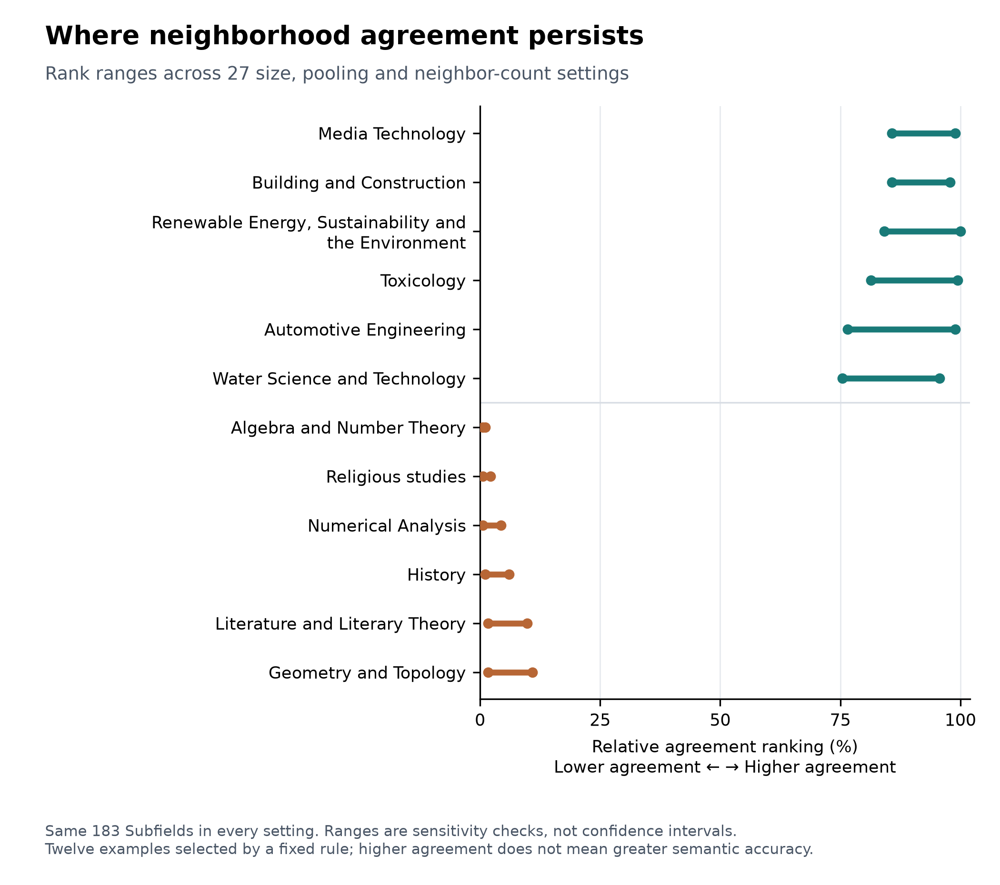

# Qué partes del mapa resisten al cambio de modelo

**Hay especialidades que se mantienen relativamente estables y relaciones concretas que dependen mucho del modelo.** Es como comparar cámaras: pueden reconocer la misma escena general y fijarse en detalles distintos.

Este seguimiento usa resultados existentes. Reglas: [CASE_ATLAS_PROTOCOL.md](CASE_ATLAS_PROTOCOL.md). Cálculo separado en `data/prepaper_v1/case_atlas/`. No cambia los resultados principales ni incorpora modelos nuevos.

## Especialidades

La tabla usa 256 artículos por especialidad y compara sus 25 vecinos entre modelos. Para elegir los ejemplos se comprobó además su posición entre las mismas 183 especialidades en **27 condiciones**: tres tamaños, tres recetas y tres cantidades de vecinos.

| Acuerdo relativamente alto y persistente | Vecinos compartidos | Acuerdo relativamente bajo y persistente | Vecinos compartidos |
| --- | ---: | --- | ---: |
| Tecnología de medios | 50,8% | Álgebra y teoría de números | 36,2% |
| Edificación y construcción | 50,6% | Estudios religiosos | 36,7% |
| Energía renovable y sostenibilidad | 51,9% | Análisis numérico | 36,9% |
| Toxicología | 49,9% | Historia | 37,0% |
| Ingeniería del automóvil | 51,8% | Literatura y teoría literaria | 39,2% |
| Ciencia y tecnología del agua | 49,0% | Geometría y topología | 40,2% |

Son posiciones comparativas, no una clasificación de calidad. Un área amplia puede tener un acuerdo alto y contener especialidades sensibles: los niveles contestan preguntas distintas. La estabilidad de posición en vecinos tampoco elimina las alertas de precisión de la forma. Construcción conserva 23/45 alertas de selección de forma; Tecnología de medios y Álgebra, cero. Todo figura en [la tabla de ejemplos](reports/prepaper_v1/subfield_examples.csv).

## Artículos y relaciones

Los ejemplos salen de 10.850 consultas fijadas previamente, con diez selecciones de 256 candidatos dentro de su especialidad. Hay 50 consultas por grupo; sus 49 compañeras están presentes siempre. Esto permite comprobar una relación sin confundir «no fue elegido como vecino» con «no estaba disponible».

**Un enlace que se conserva.** El artículo [SIRT6 y muerte de células cancerosas](https://openalex.org/W2022976570) mantiene una coincidencia media de vecinos entre **76,7% y 82,4%** al cambiar candidatos. Su relación con *Sirtuins: The NAD+-Dependent Multifaceted Modulators of Inflammation* aparece en los 25 vecinos de **los diez modelos, en las diez repeticiones**. Ambos textos tratan sirtuinas y procesos celulares. Esto describe 100 comprobaciones en estas muestras, no toda posible búsqueda.

**Un enlace que depende del modelo.** *Optical properties of cobalt clusters implanted in thin silica layers* tiene una coincidencia de vecinos de **21,3–24,4%**. Su relación con un trabajo sobre caracterización de películas finas en cerámicas aparece siempre para SPECTER, SPECTER2, SciNCL, MPNet, MiniLM y SimCSE; nunca para BERT, SciBERT, BioBERT y PubMedBERT con la receta principal. Los textos comparten materiales y capas finas, pero enfatizan propiedades y técnicas diferentes. El primero contiene mucho código de fórmulas: no podemos atribuir la diferencia solo al tema.

El mismo artículo puede conservar un enlace y perder otro. Los doce casos, las dos relaciones seleccionadas de cada uno, títulos, IDs y frecuencias modelo por modelo están en [CASES.md](reports/prepaper_v1/CASES.md) y [su tabla](reports/prepaper_v1/article_relations_readable.csv).

## Relaciones entre especialidades

Biología celular–Biología molecular y Visión artificial–Procesamiento de señales son parejas de centros que se eligen mutuamente como la especialidad más cercana en los diez modelos. Se mantiene al usar 256 artículos por grupo y al usar todos sus artículos, conservando las mismas 217 especialidades candidatas.

Otras parejas cambian mucho de posición. Geofísica–Ingeniería general pasa de rango mutuo 13 a 208 según el modelo. **Ningún modelo la coloca entre sus cinco primeras:** cambiar de posición no equivale a perder un enlace cercano. También hay parejas casi duplicadas por las etiquetas, como Language and Linguistics–Linguistics and Language; su acuerdo no es un descubrimiento temático.

[Tabla de centros](reports/prepaper_v1/subfield_relation_examples.csv). Este análisis usa la receta principal; no se ha calculado su sensibilidad a CLS/SEP. Los centros promedian artículos: no describen los vecinos de cada artículo.

## Límites descubiertos al mirar los ejemplos

La revisión detectó dos etiquetas temáticas claramente incompatibles y un aviso bibliográfico entre los doce artículos. Coinciden con OpenAlex original; se conservan con notas. Detalle y efecto del diagnóstico de avisos en [PREPAPER_REVIEW.md](PREPAPER_REVIEW.md). No llamar a todos los extremos «zonas científicas inestables»: algunos también reflejan problemas de los datos.

La tabla completa conserva las 10.850 consultas, incluidas las que tenían marcas previas. Solo los ejemplos ilustrativos aplican las exclusiones fijadas. Las omisiones de modelos/familias y las búsquedas nativas se guardan en `paper_examples.csv`; no se ha afirmado que cada enlace resista todas las recetas, entradas y tamaños.
